# CS2 Enemy Detection (YOLO)

YOLO-based real-time enemy detection for Counter-Strike 2 using **OBS Studio virtual camera**
⚠️ Educational / research purposes only.

## **[Screenshots](#-example-results)**

## Features

- Real-time enemy detection
- Trained YOLOv10 model
- Support for both GPU and CPU inference

## 📸 Detection Classes

The model can detect four classes:

- **CT_HEAD** - Counter-Terrorist head (higher priority target)
- **CT_BODY** - Counter-Terrorist body
- **T_HEAD** - Terrorist head (higher priority target)
- **T_BODY** - Terrorist body

## 🧱 Requirements

- **[OBS Studio](https://obsproject.com/)**
- **Python 3.8+**
- **NVIDIA GPU with CUDA support** (recommended for best performance)
  - Note: AMD GPUs are not tested but may work with ROCm
  - CPU inference is supported but slower

## 🚀 Quick Start

1. **Install Requirements:** OBS Studio + Python 3.8+
2. **Clone & Run:**

```bash
   git clone https://github.com/yellowdeerr/cs-vision.git
   cd cs-vision
   .\run.bat
```

3. **Configure OBS:** Start Virtual Camera (Tools → Virtual Camera)
4. **Done!** Press 'q' to quit

## ⚙️ Installation

### Option 1: Automatic Setup (Recommended)

```bash
# Clone the repository
git clone https://github.com/yellowdeerr/cs-vision.git
cd cs-vision

# Run the automated setup script (may take some time on first run)
.\run.bat
```

The script will automatically:

- Create a virtual environment
- Install all dependencies
- Configure default settings
- Launch the application

### Option 2: Manual Setup

```bash
# Clone the repository
git clone https://github.com/yellowdeerr/cs-vision.git
cd cs-vision

# Create and activate virtual environment
python -m venv .venv
.venv\Scripts\activate  # Windows
source .venv/bin/activate  # Linux/Mac

# Install dependencies
pip install -r requirements.txt

# Run the application
python -m src.main
```

## 🚀 Running the Application

### Option 1: Using the Batch Script

```bash
.\run.bat
```

### Option 2: Direct Python Execution

```bash
# Important: Always use the -m flag to run as a module
python -m src.main
```

**Note:** The `-m` flag ensures proper module imports and path resolution.

## ⚙️ Configuration

All settings can be configured by editing the `.env` file in the project root.

### GPU/CPU Selection

Choose which device to run inference on:

```env
# Use CPU (slower but works on any machine)
RENDER_DEVICE=cpu

# Use first GPU (recommended if you have NVIDIA GPU)
RENDER_DEVICE=0

# Use multiple GPUs
RENDER_DEVICE=0,1,2
```

### Video Testing Mode

Test the detection on a video file instead of live camera:

```env
# Enable video mode
USE_VIDEO=1

# Specify video location (relative to test_media/)
VIDEO_NAME=gameplay.mp4
```

1. Place your test video in the `test_media/` folder
2. Set `USE_VIDEO=1` in `.env`
3. Set `VIDEO_NAME` to your video filename (include extension like `.mp4`)

### FPS Counter Configuration

Customize the FPS display behavior:

```env
# How often to update FPS display (in seconds)
UPDATE_FPS_DELAY=0.05

# Number of frames to average for FPS calculation
# Higher = smoother but less responsive to changes
FPS_VALUES_DEQUE_SIZE=20

# Decimal places for FPS display (0-3)
ROUND_FPS_DIGITS=2
```

**FPS Settings Explained:**

- **`UPDATE_FPS_DELAY`**: Display refresh rate
  - `0.05` = Update every 50ms (20 updates/sec) - **Responsive** ⚡
  - `0.1` = Update every 100ms (10 updates/sec) - Balanced
  - `0.5` = Update every 500ms (2 updates/sec) - **Laggy** 🐌
  - **Lower is better** for responsive display
- `FPS_VALUES_DEQUE_SIZE`: Sliding window size for averaging
  - Smaller (5-10): More reactive to FPS changes, jumpier display
  - Larger (20-50): Smoother display, slower to reflect changes
- `ROUND_FPS_DIGITS`: Display precision
  - `0` = `60 FPS`
  - `1` = `59.5 FPS`
  - `2` = `59.52 FPS`

### Camera Configuration

```env
# Camera device index (try different values if camera not detected)
CAMERA_INDEX=1  # Usually 0 for built-in webcam, 1+ for external/virtual cameras
```

### Cv2 Window Configuration

```env
# Output window with model's result. Window's width and height
FRAME_WIDTH=640
FRAME_HEIGHT=480
```

### Model Settings

```env
# Path to trained model weights (relative to project root)
MODEL_PATH=models/best.pt

# Detection confidence threshold (0.0 - 1.0)
# Higher = fewer false positives but may miss some detections
CONFIDENCE=0.5
```

## 🎮 OBS Studio Setup

To use this with CS2, you need to set up OBS Virtual Camera:

1. **Install [OBS Studio](https://obsproject.com/download)**
2. **Add Game Capture** source for CS2
3. **Start Virtual Camera** (Tools → Virtual Camera → Start)
4. **Set CAMERA_INDEX in .env** to match your virtual camera (usually 1 or 2)
5. **Run the detection application**

## 🧪 Example Results

Below are some sample detections generated using `yolo predict` command on the trained model.

| Original                     | Detection                     |
| ---------------------------- | ----------------------------- |
| 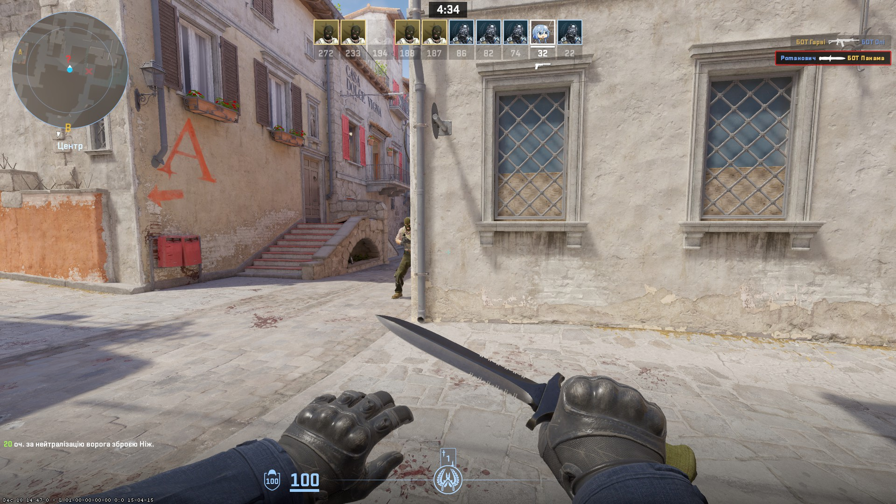 | 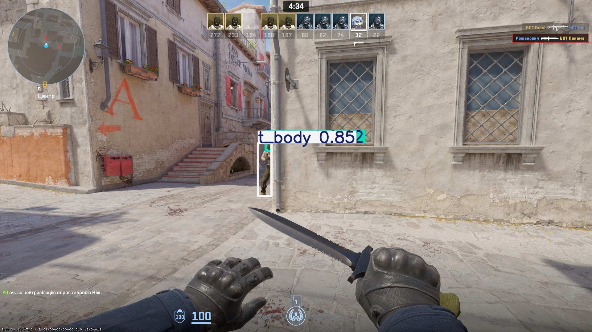 |
| 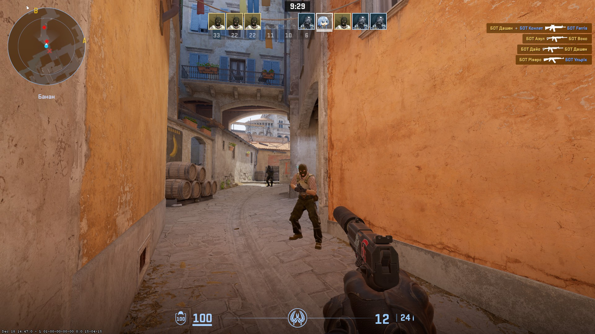 | 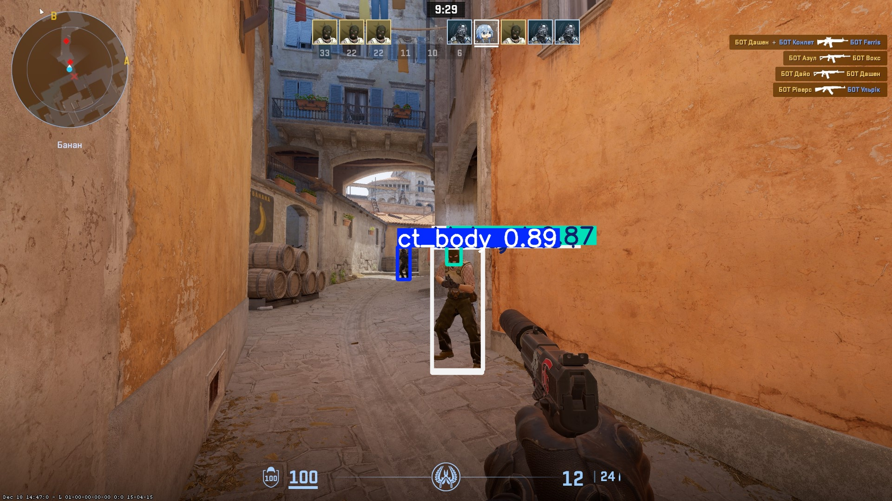 |
| 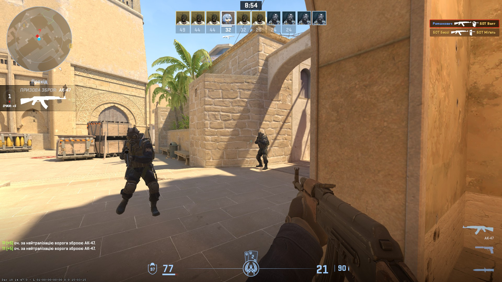 | 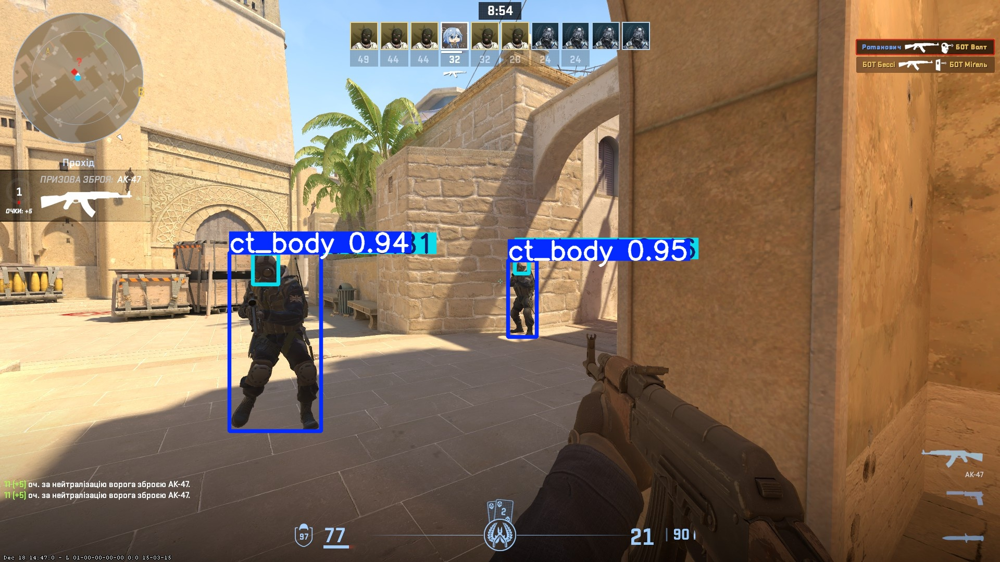 |
| 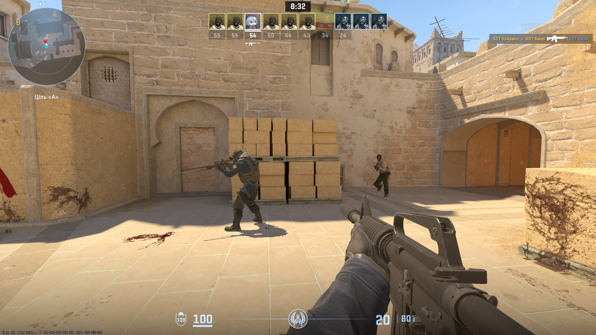 |  |
| 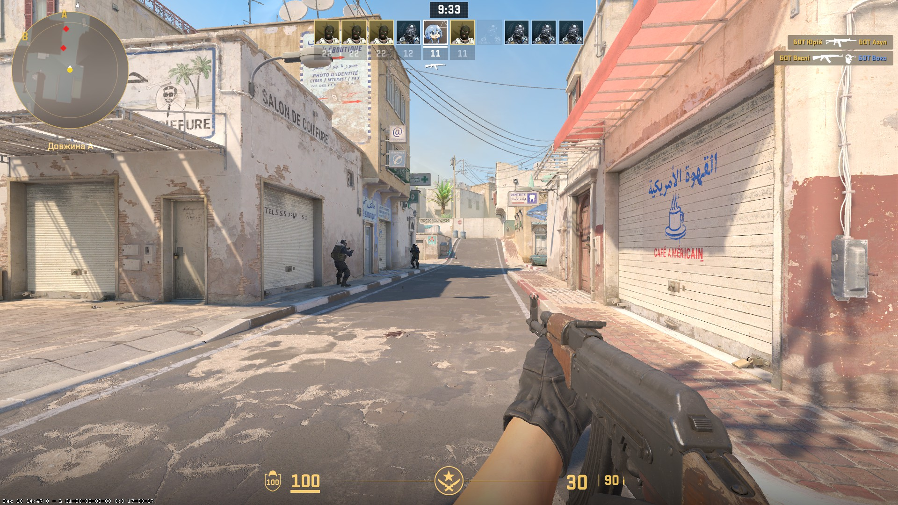 | 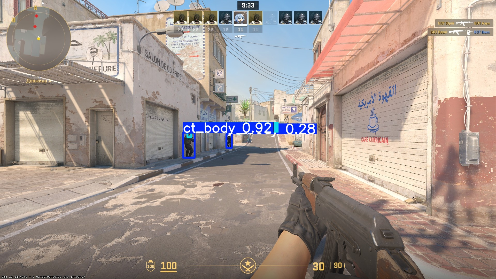 |
| 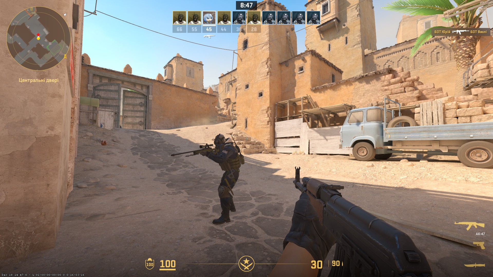 | 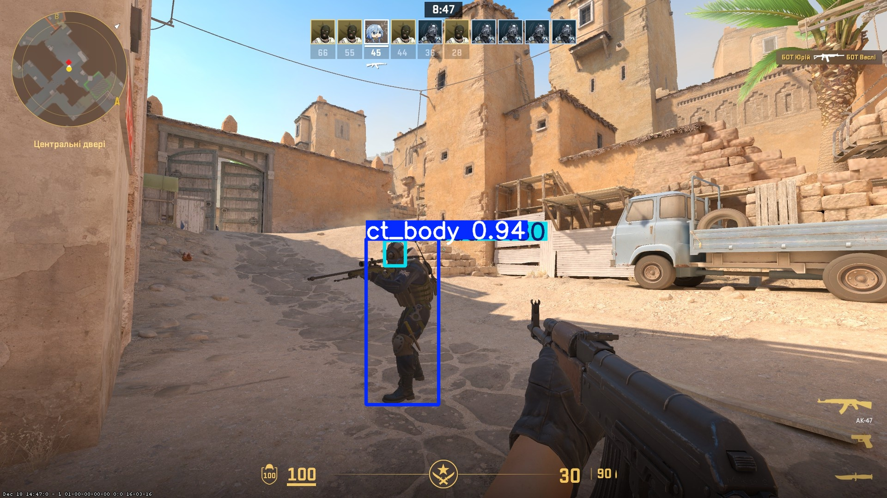 |

## 🐛 Troubleshooting

### Camera Not Detected

- Try different `CAMERA_INDEX` values (0, 1, 2, 3...)
- Ensure OBS Virtual Camera is started
- Check if another application is using the camera
- Verify camera permissions in Windows settings

### Low FPS / Performance Issues

- Switch to GPU: `RENDER_DEVICE=0`
- Reduce cs2 resolution
- Reduce obs virtual camera resolution
- Close other resource-intensive applications
- Ensure NVIDIA drivers are up to date

### Model Not Found Error

- Verify `models/best.pt` exists in the project folder
- Check `MODEL_PATH` in `.env` is correct
- Re-download the model if necessary

### Import Errors

- Always run with: `python -m src.main` (note the `-m` flag)
- Ensure virtual environment is activated
- Reinstall dependencies: `pip install -r requirements.txt`
