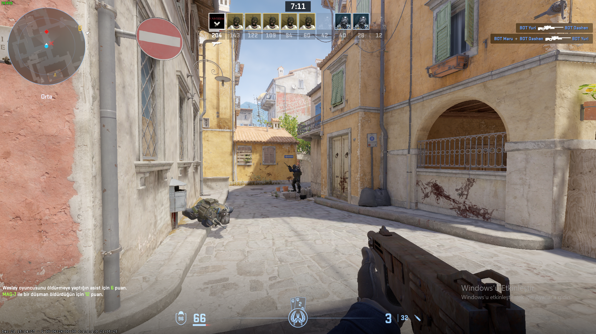
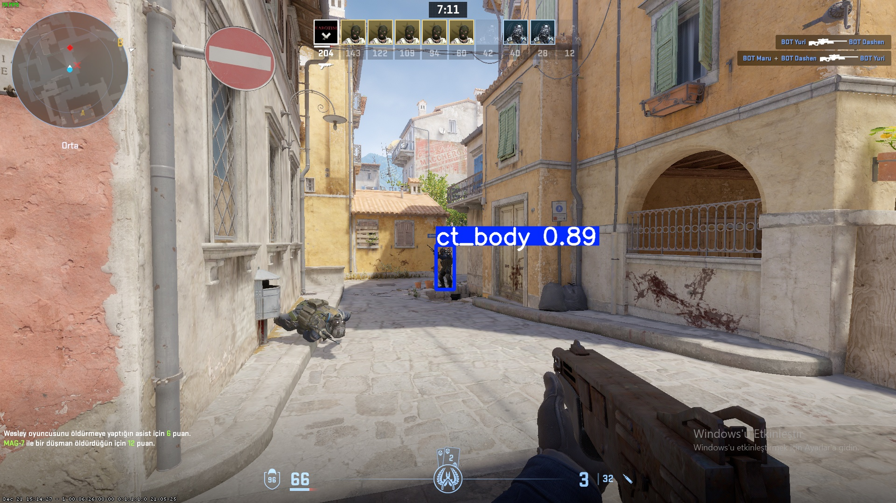
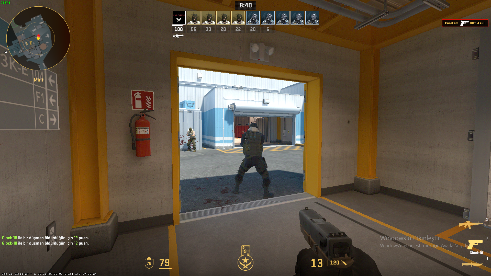
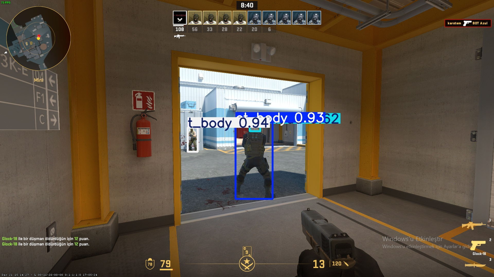
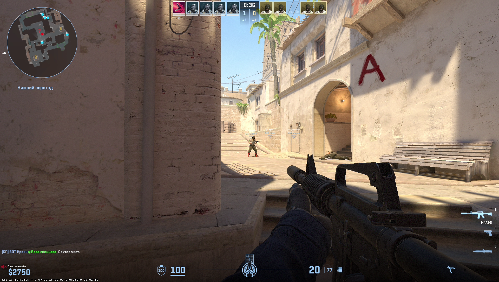
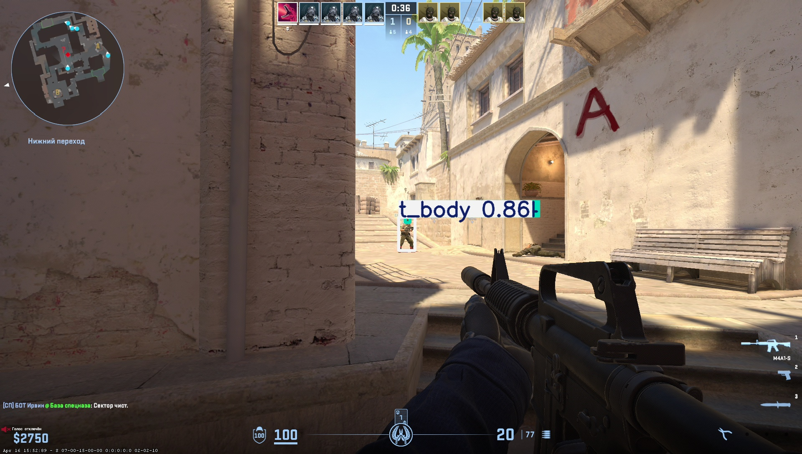
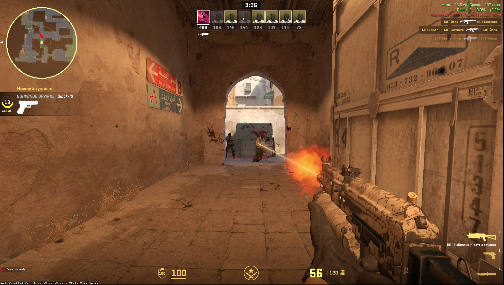
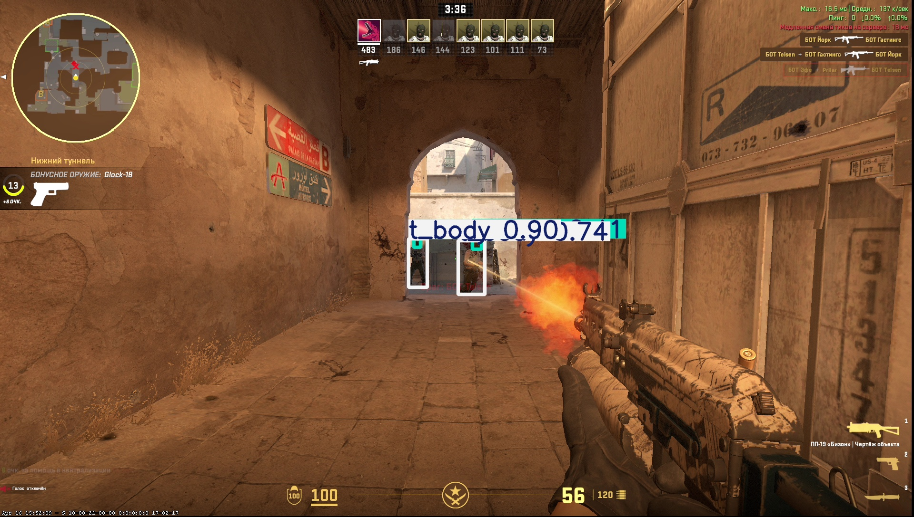
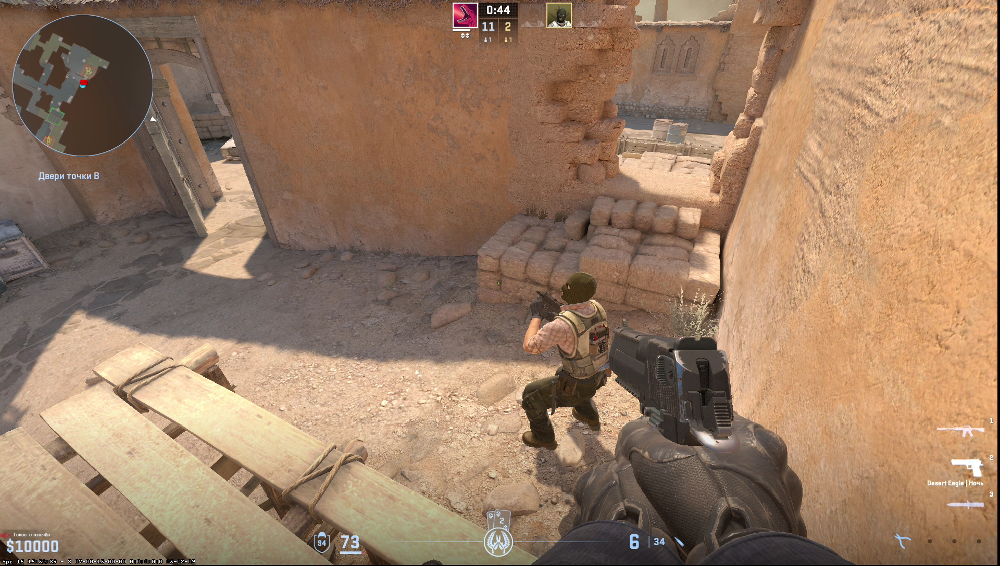
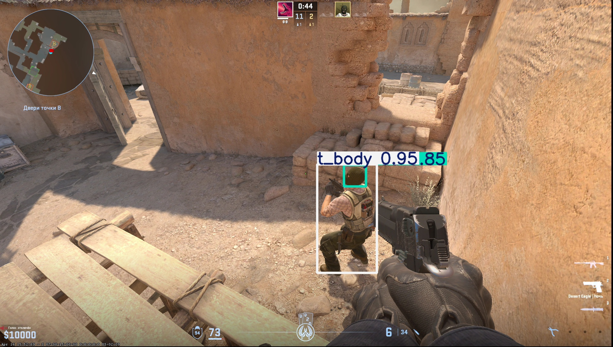

# 🧠 CS2 Computer Vision — YOLOv10 Player Detection

This project demonstrates a **YOLOv10-based computer vision model** trained to recognize **CT** and **T** players in _Counter-Strike 2_ gameplay.  
It supports **real-time detection** using an **OBS Studio virtual camera**, enabling live object detection directly from the game stream.

---

## 📸 Overview

The model can detect:

- 🟦 **CT (Counter-Terrorists)**
- 🟥 **T (Terrorists)**

Training and testing were performed on a **custom dataset** collected from CS2 gameplay screenshots and clips.

---

## 🚀 Features

- 🔹 Custom-trained **YOLOv10** model
- 🔹 Detects CT and T players in screenshots or live gameplay
- 🔹 Real-time object detection via **OBS Virtual Camera**
- 🔹 Lightweight and optimized for GPU acceleration
- 🔹 Example inference results provided in `/docs`

---

## 🧪 Example Results

Below are some sample detections generated using `yolo predict` command on the trained model.

| Original                           | Detection                        |
| ---------------------------------- | -------------------------------- |
|  |  |
|  |  |
|  |  |
|  |  |
|  |  |

---

## 🧩 Model Information

| Property            | Description                   |
| ------------------- | ----------------------------- |
| **Model**           | YOLOv10                       |
| **Framework**       | Ultralytics                   |
| **Classes**         | 2 (`CT`, `T`)                 |
| **Training Source** | Custom CS2 dataset            |
| **Use Case**        | In-game detection via OBS     |
| **Output**          | Bounding boxes + class labels |

---

## 🎮 Real-Time Detection Setup

This project can process live CS2 gameplay using **OBS Studio** and its **Virtual Camera** feature.

### 🧱 Requirements

- [OBS Studio](https://obsproject.com/)
- [Ultralytics YOLO](https://docs.ultralytics.com/)
- Python 3.10+
- GPU (recommended for real-time inference)

### ⚙️ How to Use

1. Open **OBS Studio** and start the **Virtual Camera**.
2. Add _CS2 gameplay window_ as a video source.
3. In your Python script or CLI, set the YOLO `source` to the virtual camera feed:
   ```bash
   yolo predict model=modesl/trained/best.pt source=0
   ```
